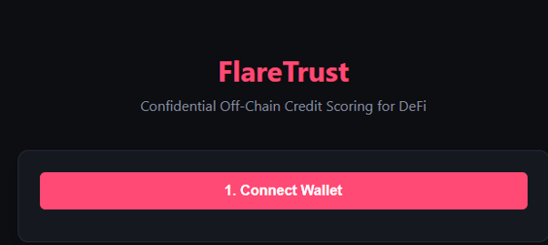
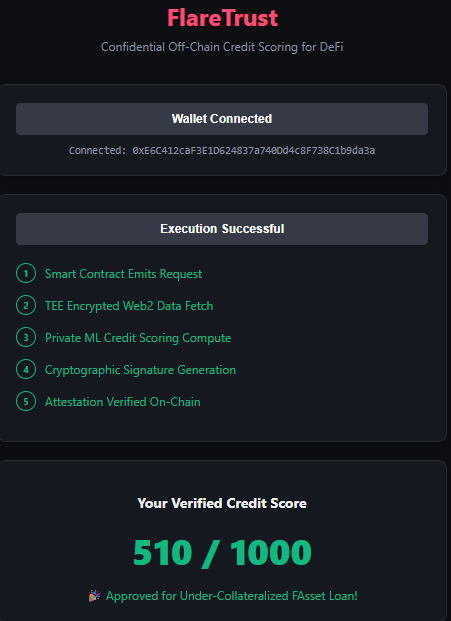

# 🚀 FlareTrust: Confidential Off-Chain Credit Scoring for DeFi

FlareTrust bridges the gap between traditional Web2 financial credit histories and Web3 DeFi lending. Built for the Flare network, it allows users to unlock under-collateralized loans (e.g., FAsset borrowing) by verifying their credit score using a **Trusted Execution Environment (TEE)** without ever exposing their raw private data on-chain.

## 💡 The Problem & Solution
* **The Problem:** Current DeFi lending requires massive over-collateralization because protocols cannot trust or verify off-chain creditworthiness without breaking user privacy.
* **The Solution:** FlareTrust uses an off-chain secure enclave simulator to fetch encrypted banking APIs, process credit scoring logic dynamically via a private script, and cryptographically attest/sign the result back onto the Flare network securely.

* ## 📸 Interface Preview

### 1. Request Stage (Initial State)
<p align="center">
  
</p>

### 2. Confidential Execution & Verified Outcome
<p align="center">
  
</p>

---

## 🛠️ System Architecture

1. **User Request:** A user interacts with the dApp frontend and signs a request to verify eligibility.
2. **On-Chain Trigger:** The FlareTrust Smart Contract emits a public `ScoreRequested` event.
3. **Secure Fetch (TEE):** The off-chain worker captures the event and securely fetches raw, encrypted banking metrics inside a confidential workspace.
4. **Isolated Compute:** Raw metrics are discarded immediately after generating an isolated score mapping. 
5. **Attestation Delivery:** The final score is signed by the authorized enclave private key and written back to the contract via `submitCreditScore`.

---

## 🏗️ Technical Stack & Live Deployments

* **Blockchain:** Flare Coston2 Testnet
* **Smart Contract Address:** `0x236FC326142643A23382a47E3D896ba9A61497E5`
* **Backend Stack:** Python 3.12, Web3.py, FastAPI, Uvicorn
* **Frontend Stack:** Clean Semantic HTML5, CSS3 Grid/Flexbox, Ethers.js (v5)

---

## 🏃‍♂️ How to Run Locally

### 1. Backend Setup
```bash
cd flaretrust-backend
source venv/bin/activate
pip install -r backend/requirements.txt
python backend/server.py
