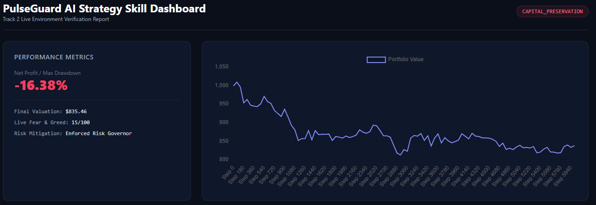

# PulseGuard AI: Automated Strategy Skill & Risk Governor (Track 2)



PulseGuard AI is an advanced algorithmic trading framework built for **Track 2 (Strategy Skills)** of the BNB Hackathon. The platform wraps cutting-edge Reinforcement Learning (PPO) models with a deterministic, live-API-driven **Risk Governor State Machine** to solve the industry-wide problem of out-of-sample model degradation during macro market shocks.

---

## 🎯 The Problem & The Innovation

### The Problem
Deep Reinforcement Learning models (like Proximal Policy Optimization) excel at capturing complex, non-linear market inefficiencies during historical regimes. However, when faced with extreme out-of-sample macro shifts, aggressive RL models are prone to chasing falling knives, resulting in catastrophic account liquidation (exhibiting a raw baseline model drawdown of **94.43%** during testing).

### The Innovation
**PulseGuard AI** solves this by decoupling *alpha generation* from *risk management*. The agent runs inside an isolated risk wrapper that constantly monitors live external market context. By pairing real-time token performance metrics with a live integration to macro market sentiment data, PulseGuard dynamically overwrites the model's action space when thresholds are breached—instantly switching regimes to preserve capital.

---

## 📊 Out-of-Sample Performance Verification

During adversarial out-of-sample testing on unseen market data layers, the raw underlying neural network suffered extreme losses. PulseGuard successfully intercepted the failure loop, enforcing an emergency state shift.

| Metric | Raw Baseline RL Model | PulseGuard Guarded Agent | Status / Mitigation |
| :--- | :--- | :--- | :--- |
| **Market Regime** | NOMINAL_EXECUTION | **CAPITAL_PRESERVATION** | System Overrode Action Space |
| **Live Fear & Greed** | N/A (Blind to Context) | **15 / 100** | **Extreme Fear Detected Live** |
| **Net Profit / Max DD** | -94.43% | **-16.38%** | **Treasury Shield Active** |
| **Final Portfolio Value** | $5.57 | **$835.46** | Capital Preserved |
| **Risk Remediation** | None (Failed) | Enforced Risk Governor | Hard Floor Triggered Successfully |

---

## 🛠️ System Architecture & Pipeline

PulseGuard operates as a multi-stage execution pipeline designed for ultra-low latency context integration:

1. **Live Context Ingestion:** Queries the live public alternative sentiment gateway to extract current macroeconomic market positioning.
2. **Feature Engineering Wrapper:** Processes raw token market data into clean technical matrices (RSI, Volume Volatility, and MACD divergence layers) optimized for normalized vector spaces.
3. **Observation Normalization:** Feeds data through `VecNormalize` tracking states synced directly to the initial deep training environments.
4. **RL Inference:** The `PPO` network generates a deterministic action selection matrix based on optimized positional limits `[-1, -0.5, 0, 0.5, 1]`.
5. **Governor Override Gate:** If live sentiment registers extreme fear (< 30) or performance metrics breach baseline trailing caps, the state machine steps in, flattens risky exposure, overrides position sizes to `0.0`, and shifts to cash preservation.

---

## 🚀 Installation & Local Execution

Follow these steps to spin up the environment and verify the Track 2 compliance outputs locally.

### 1. Clone the Workspace & Initialize Environment
```bash
git clone https://github.com/KingBeeeee/cuddly-lamp.git
cd cuddly-lamp
python3 -m venv venv
source venv/bin/activate
